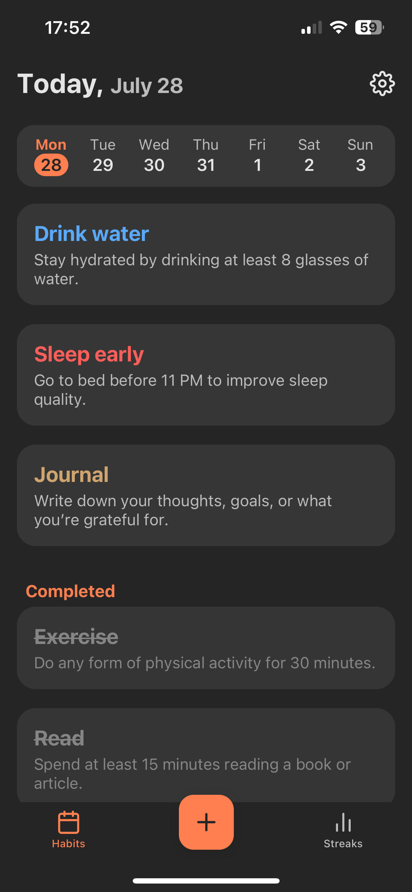
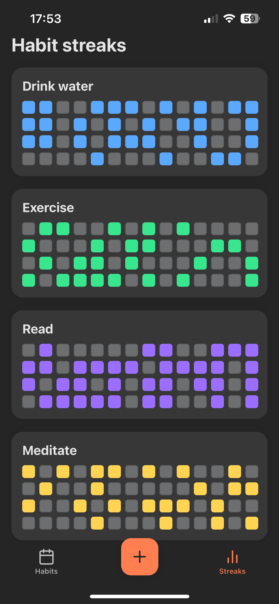

# Habit Tracker - Mobile App

A beautifully crafted habit tracking app built with **React Native**, **Expo**, and **Supabase**, designed to help users build consistency and stay on track with their personal goals.

## Features

- Create, manage, and delete habits
- Choose frequency: daily, weekly, or monthly
- Select specific days for custom habit repetition
- Mark habits as completed or skipped
- Visualize progress with a streak view similar to GitHub’s contributions chart
- Multi-language support (English and Spanish)
- Light/Dark theme toggle
- Responsive and smooth UI for mobile devices

## Screens

- **Home:** Calendar and habit list for the selected day
- **Streaks:** Visual streak overview for each habit
- **Add Habit:** Form to create new habits with color, frequency, and repeat days
- **Settings:** Language and theme toggle, logout

  

  
  
  
  

## Tech Stack

- **React Native** with Expo
- **Supabase** (PostgreSQL + Auth) for backend
- **expo-router** for routing
- **react-native-paper** for UI components
- **react-i18next** for localization
- **Context API** for global state (habits and completions)

## Architecture

- Centralized context for managing habits and their completion status
- Modular components: `HeaderCalendar`, `WeekCalendar`, `HabitsList`, `HabitGrid`, etc.
- Internationalization and theming integrated into the core layout
- Auto-refresh logic to keep the UI in sync across screens without reloads

## Authentication

User authentication is handled via **Supabase Auth**. Route protection is implemented through a custom `RouteGuard` component that redirects unauthenticated users to the login screen.

## Why this project?

This app was built to demonstrate:
- Clean state management with context
- Modern mobile UI design using React Native
- Integration with Supabase as a scalable backend
- Real-time UI feedback without full-screen reloads
- A user-friendly, multilingual experience

